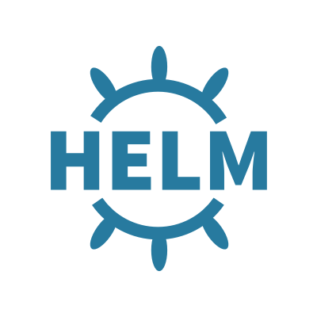

  

## HELM Charts

 
 
 

This repository includes a few charts that we use on our Kubernetes clusters.

Each chart has its own `README` with installation steps and configurable `values.yaml`.

### List of charts available

- [Elasticsearch](https://github.com/gofynd/helm-charts/tree/master/elasticsearch)
- [Fluent-bit](https://github.com/gofynd/helm-charts/tree/master/fluent-bit)
- [Kibana](https://github.com/gofynd/helm-charts/tree/master/kibana)

